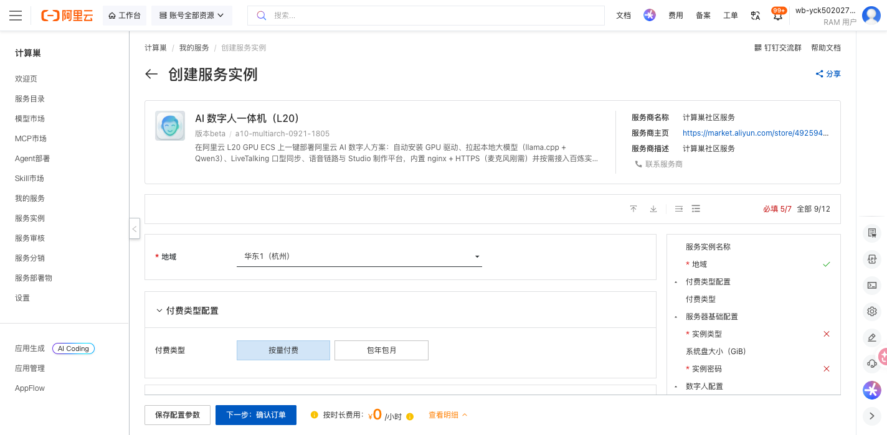
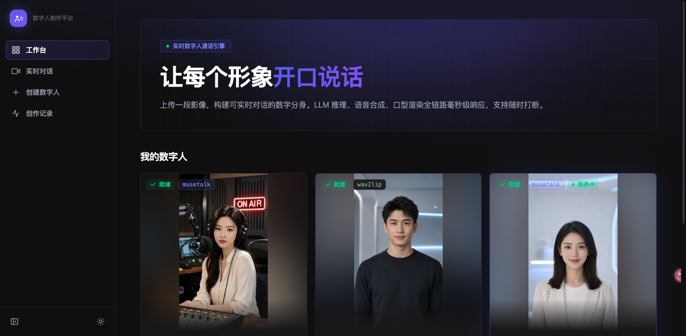

# AI实时数字人通话 部署文档

## 概述

AI实时数字人通话是一款在阿里云 GPU ECS 上开箱即用的实时数字人一体化方案。服务将 GPU 驱动、本地大模型（llama.cpp + Qwen3）、口型同步（LiveTalking + wav2lip256）、语音链路与 Studio 制作平台等重资产在部署物镜像构建期烘焙，部署时自动补齐 Studio（写入百炼 API-KEY）、HTTPS（绑定公网 IP）与按 GPU 算力重编的本地大模型组件，内置 nginx + HTTPS（麦克风刚需）。通过阿里云计算巢服务，您可以一键部署，部署完成后即可通过公网 HTTPS 打开数字人对话与制作界面。

支持规格：`ecs.gn8is`（NVIDIA L20，单卡 48GB 显存）与 `ecs.gn7i`（NVIDIA A10，单卡 24GB 显存）等 GPU 规格，部署期会按实际 GPU 算力自动重编 llama.cpp，无需人工干预。

## 计费说明

AI实时数字人通话在计算巢上的费用主要涉及：

- 所选 GPU 实例规格（`ecs.gn8is` / `ecs.gn7i` 等）
- 系统盘类型及容量（默认 100 GiB）
- 公网带宽（按使用流量或固定带宽计费）

计费方式包括按量付费与包年包月，预估费用在创建实例时可实时看到。

## 部署架构

服务采用 **单台 GPU ECS + EcsImage 部署物** 架构：GPU 驱动、本地大模型、口型权重与形象包在部署物镜像构建期烘焙，部署期在同一台实例上补齐 Studio、HTTPS 与未烘焙的 GPU 组件，通过实例公网 IP 直接对外提供 HTTPS 与 WebRTC 媒体服务。

## RAM账号所需权限

AI实时数字人通话需要对 ECS、VPC 等资源进行访问和创建操作。若您使用 RAM 用户创建服务实例，需要在创建服务实例前，为该 RAM 用户添加相应资源的权限。添加 RAM 权限的详细操作，请参见[为RAM用户授权](https://help.aliyun.com/document_detail/121945.html)。所需权限如下表所示。

| 权限策略名称 | 备注 |
| --- | --- |
| AliyunECSFullAccess | 管理云服务器服务（ECS）的权限 |
| AliyunVPCFullAccess | 管理专有网络（VPC）的权限 |

## 部署流程

### 1. 创建服务实例

访问 AI实时数字人通话 服务部署链接，按提示填写部署参数：

[部署链接](https://computenest.console.aliyun.com/service/instance/create/cn-hangzhou?type=user&ServiceId=service-9696c9a2a76f4d9eabf9)

关键参数说明：

| 参数 | 必填 | 说明 |
| --- | --- | --- |
| 地域 / 可用区 | 是 | 选择有对应 GPU 规格库存的可用区（如华东1杭州的可用区 J / K） |
| 实例规格 | 是 | 选择 GPU 规格：`ecs.gn8is`（L20）或 `ecs.gn7i`（A10）系列 |
| 系统盘 | 是 | 默认 100 GiB（模型 + 运行环境约 40G+），最小 100 |
| 实例密码 | 是 | 实例登录密码 |
| 百炼 API-KEY | 否 | 用于 Studio 生图/生视频；不配置数字人对话等核心功能仍可用 |
| 域名 | 否 | 已解析到本实例公网 IP 的域名，配置后签发 Let's Encrypt 免告警证书 |
| 数字人形象 ID | 否 | 默认数字人形象 |

### 2. 确认订单并创建

参数填写完成后可以看到对应询价明细，确认参数后点击 **下一步：确认订单**。确认订单完成后同意《计算巢服务协议》并点击 **立即创建** 进入部署阶段。

### 3. 等待部署完成

创建后点击 **去列表查看** 进入服务实例列表，可看到新建实例处于「部署中」。服务会自动完成 GPU 驱动加载、本地大模型按当前 GPU 算力重编、语音/口型/Studio 组件拉起与 HTTPS 配置。

- 若部署物镜像构建期已烘焙 GPU 组件，部署期通常仅需数分钟（补齐 Studio + HTTPS）；若需在线补齐并重编本地大模型等组件，约 15–25 分钟。
- 部署进度与日志：实例内 `/var/log/ai-avatar-install.log`；完成后写入 `/root/ai-avatar.done`。
- 当实例状态变为「已部署」后，在服务实例详情页的「立即使用」处可获取访问链接，形如 `https://<实例公网IP>/`。

### 4. 访问服务

在服务实例详情页点击访问链接（`https://<实例公网IP>/`）打开服务。默认使用自签 HTTPS 证书（麦克风刚需 HTTPS），浏览器首次会提示「您的连接不是私密连接」，点击 **高级 → 继续前往** 即可打开 LiveTalk Studio 数字人制作平台。进入后可在「我的数字人」中选择已就绪的形象开始实时对话，或创建新的数字人。

## 问题排查

- **画面黑屏 / 无视频流**：确认安全组已放行 **UDP 50000-50100**（WebRTC 媒体端口），否则口型画面无法建立。
- **无法打开页面**：数字人对麦克风的调用强依赖 HTTPS，请通过 `https://<公网IP>/` 访问；自签证书场景需在浏览器点击 **高级 → 继续前往**。
- **部署进度停滞或失败**：登录实例查看 `/var/log/ai-avatar-install.log`；部署脚本对偶发网络失败会自动重试（最多 3 次），完成后写入 `/root/ai-avatar.done`。
- **Studio 生图/生视频不可用**：确认已在部署参数中填写有效的百炼 API-KEY。

## 联系我们

更多技术实现与参数说明请参见仓库内服务技术说明 [.computenest/README.md](https://github.com/aliyun-computenest/quickstart-ai-real-time-digital-human-call/blob/main/.computenest/README.md)。
